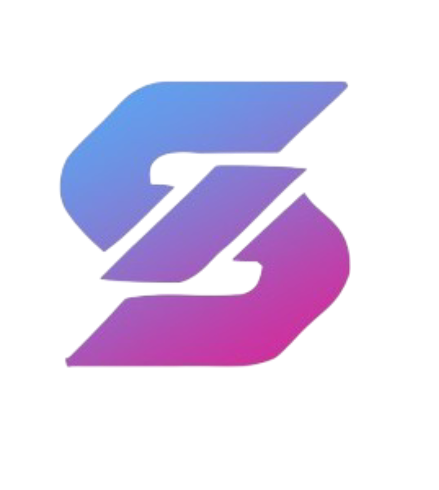

# SkyZuri Techbridges

<div align="center">
  
</div>

## Overview

SkyZuri Techbridges is a cutting-edge technology company specializing in innovative digital solutions. Founded in 2020, we empower businesses and individuals with advanced technologies including AI, Blockchain, Cybersecurity, Cloud Computing, and Software Engineering. Our mission is to bridge the gap between complex emerging tech and practical business solutions, enabling our clients to innovate with confidence and shape the future.

## Features

### 🏠 Homepage
- Hero section with company introduction
- Services overview
- Portfolio highlights
- Call-to-action for demos

### 📋 Services
We offer a comprehensive range of technology services:
- **Digital Marketing**: SEO, Social Media Management, PPC Advertising
- **UI/UX Design**: User Research, Wireframing, Prototyping
- **Graphic Design**: Branding, Marketing Materials, Social Media Graphics
- **Web Solutions**: Custom Websites, E-commerce, PWAs
- **AI & ML**: Predictive Analytics, NLP, Computer Vision
- **Cybersecurity**: Vulnerability Assessments, Network Security
- **Cloud Computing**: Migration, AWS/Azure/GCP, DevOps
- **Student Projects**: Mentorship and Technical Support
- **Automation**: RPA, Workflow Integration
- **PCB Building**: Schematic Design, Prototyping
- **Blockchain**: Smart Contracts, DApps, Tokenization

### 👥 About Us
- Company story and journey since 2020
- Certifications: MSME, Udyam, Startup India
- Vision and mission statements
- Collaborations and partnerships

### 👨‍💼 Team
Meet our expert team:
- Mohamed Murshal Ibrahim (Founder & CEO)
- Madan (Lead Developer)
- Nimal (UI/UX Designer)

### 💼 Careers
Current job openings in Engineering, Marketing, and Design departments.

### 📞 Contact
- Phone: +91 9385816887
- Email: connect.skyzuri@gmail.com
- Address: Madurai, Tamil Nadu, India
- LinkedIn: [Mohamed Murshal Ibrahim](https://www.linkedin.com/in/mohamedmurshalibrahim)

### 🤖 Additional Features
- Interactive chatbot for user assistance
- Request demo functionality
- FAQ and Support sections
- Privacy Policy and Terms of Service
- Responsive design for all devices

## Tech Stack

### Frontend
- **React 19.2.0** - Modern JavaScript library for building user interfaces
- **TypeScript** - Typed superset of JavaScript
- **Vite** - Fast build tool and development server
- **Framer Motion** - Animation library for React
- **Lucide React** - Beautiful icon library
- **React Router DOM** - Declarative routing for React

### Backend & Integrations
- **EmailJS** - Send emails directly from client-side
- **Google Generative AI** - AI-powered features

### Development Tools
- **ESLint** - Linting utility
- **Vite Plugin React** - React plugin for Vite

## Project Structure

```
skyzuri-technologies/
├── components/           # React components
│   ├── Header.tsx       # Navigation header
│   ├── Home.tsx         # Homepage component
│   ├── Services.tsx     # Services listing
│   ├── About.tsx        # About page
│   ├── Team.tsx         # Team page
│   ├── Contact.tsx      # Contact form
│   ├── Footer.tsx       # Site footer
│   └── ...              # Other components
├── images/              # Static assets
├── fonts/               # Custom fonts
├── constants.ts         # Application constants and data
├── types.ts             # TypeScript type definitions
├── App.tsx              # Main application component
├── index.tsx            # Application entry point
└── package.json         # Project dependencies
```

## Installation

### Prerequisites
- Node.js (version 16 or higher)
- npm or yarn package manager

### Setup Instructions

1. **Clone the repository:**
   ```bash
   git clone https://github.com/your-username/skyzuri-techbridges.git
   cd skyzuri-techbridges
   ```

2. **Install dependencies:**
   ```bash
   npm install
   ```

3. **Set up environment variables:**
   Create a `.env.local` file in the root directory and add necessary API keys:
   ```
   GEMINI_API_KEY=your_gemini_api_key_here
   ```

4. **Start the development server:**
   ```bash
   npm run dev
   ```

5. **Build for production:**
   ```bash
   npm run build
   ```

6. **Preview production build:**
   ```bash
   npm run preview
   ```

## Usage

The application will be available at `http://localhost:5173` (default Vite port).

Navigate through different sections using the header menu:
- Home: Company overview and featured services
- Portfolio: Showcase of completed projects
- About Us: Company story and team information
- Team: Meet the leadership and key personnel
- Careers: View current job openings
- Services: Detailed service offerings
- Contact: Get in touch with us

## Contributing

We welcome contributions to SkyZuri Techbridges! Please follow these steps:

1. Fork the repository
2. Create a feature branch (`git checkout -b feature/AmazingFeature`)
3. Commit your changes (`git commit -m 'Add some AmazingFeature'`)
4. Push to the branch (`git push origin feature/AmazingFeature`)
5. Open a Pull Request

## License

This project is proprietary software owned by SkyZuri Techbridges. All rights reserved.

## Contact Information

For inquiries, partnerships, or support:

- **Email:** connect.skyzuri@gmail.com
- **Phone:** +91 9385816887
- **Address:** Madurai, Tamil Nadu, India
- **LinkedIn:** [Mohamed Murshal Ibrahim](https://www.linkedin.com/in/mohamedmurshalibrahim)

---

*Empowering innovation through technology since 2025*
